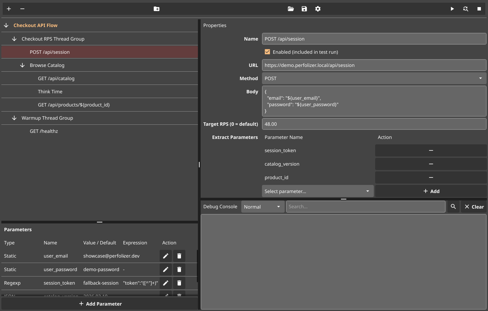
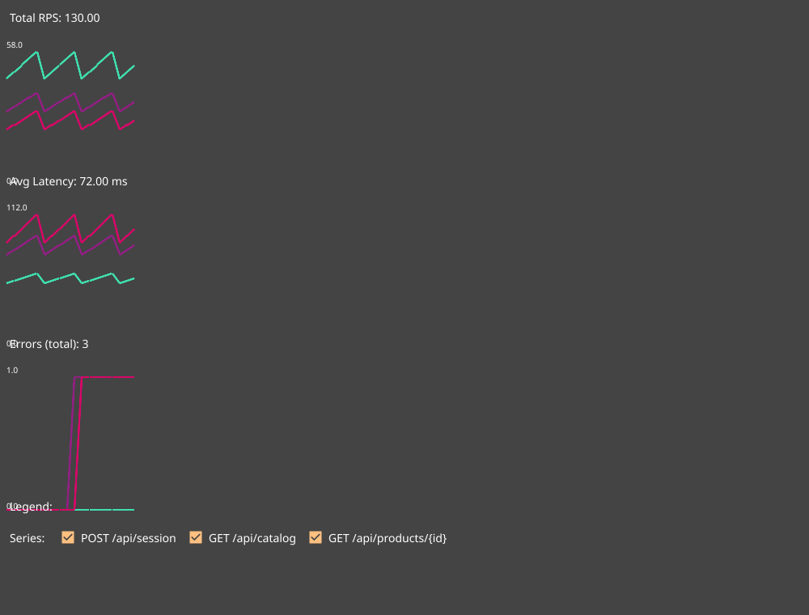
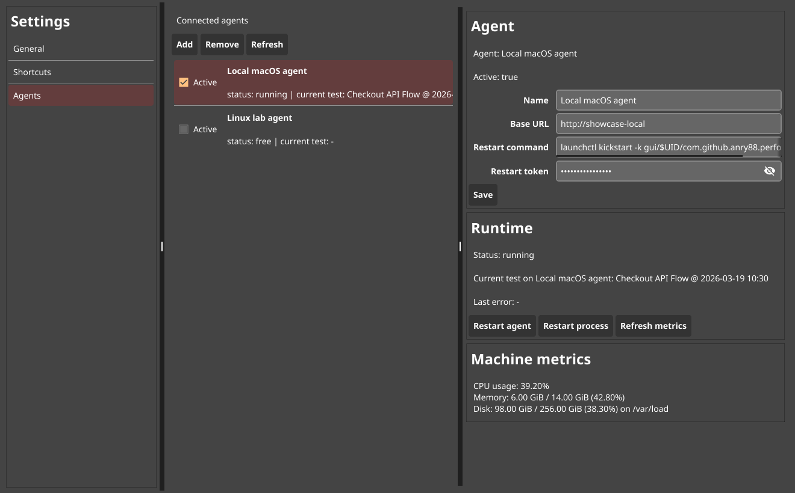
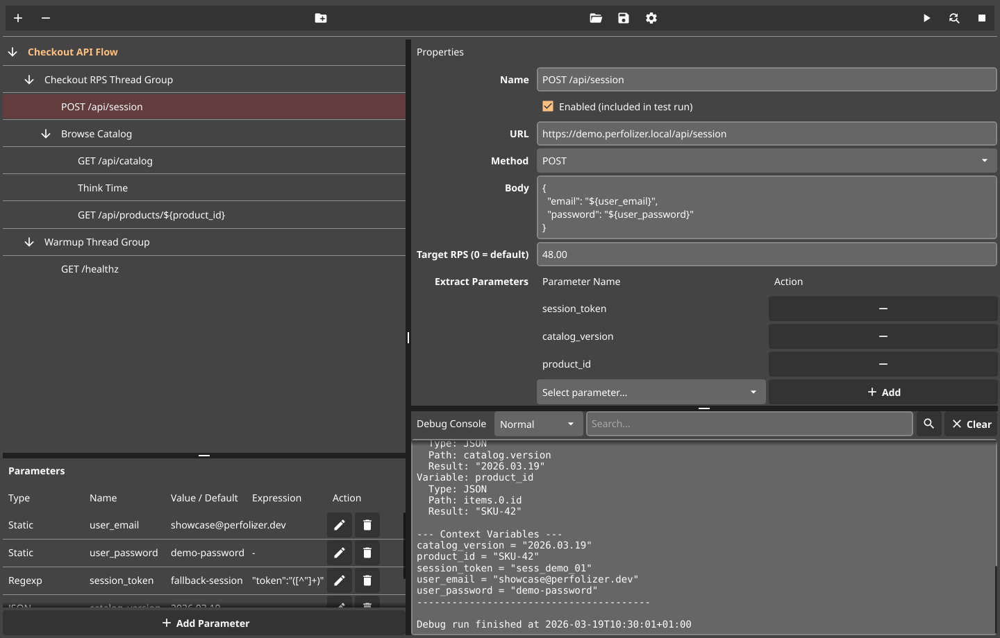

# Perfolizer

Perfolizer is a Go-based load testing tool with a native desktop UI, a separate execution agent, and Prometheus-native runtime visibility.

It is built for teams that want a visual performance-testing workflow without coupling test authoring to the load generator process. The current product focuses on HTTP/API scenarios, tree-based plan editing, live metrics, agent management, and request/debug extraction workflows.

Perfolizer is not trying to replace every performance-testing stack. It sits between heavyweight GUI-first tooling and code-first runners: a desktop workflow for building plans visually, running them through a dedicated agent, and inspecting runtime data through Prometheus-style metrics.

| Test Plan Editor | Runtime Dashboard |
| --- | --- |
|  |  |
| Agent Settings | Debug Console |
|  |  |

## Why Perfolizer For This Workflow?

- Native desktop editor for tree-based test plans, parameters, and request debugging.
- Separate execution agent keeps the UI responsive and decouples authoring from the test runtime lifecycle.
- Prometheus metrics are exposed directly by the agent at `/metrics`, which makes it easy to integrate with existing observability workflows.
- Smaller Go codebase and split UI/agent architecture are designed for fast local iteration during test authoring and product evolution.
- Project files are JSON-serializable and the agent accepts test plans over HTTP, which makes scripted generation and AI-assisted workflows practical.

## Where It Fits

- Internal performance tooling and platform engineering use cases.
- API/performance engineers who want GUI-driven authoring with a dedicated runtime process.
- Teams already invested in Prometheus/Grafana style observability.
- Workflows where a code-only runner is not the preferred authoring model, but a traditional JMeter setup feels heavier than necessary.

## Comparison At A Glance

| Category | Perfolizer | JMeter | k6 |
| --- | --- | --- | --- |
| Primary interface | Native desktop GUI + separate agent | Desktop GUI with CLI/remote modes | CLI runner with scripted tests |
| Test authoring model | Visual tree editor with JSON-backed plans | GUI test plans and XML-based configuration | Code-first scripts |
| Runtime separation | Dedicated agent process by default | GUI and engine are commonly used together, with remote engines available when needed | Runner process/container driven from CLI or CI |
| Observability workflow | Built-in Prometheus `/metrics` endpoint on the agent | Listener/exporter setup depends on project configuration | Built-in summaries plus outputs/integrations |
| Local iteration style | Edit visually, run on an agent, inspect metrics/debug data | GUI authoring with a broader runtime surface | Edit scripts, run from terminal/CI |
| Best fit | Desktop-first load tooling with agent-based execution and Prometheus visibility | Broad, established GUI-driven load testing workflows | Code-centric, automation-heavy performance pipelines |

## Current Capabilities

- Native desktop UI built with Fyne.
- Separate agent process for test execution.
- Multi-plan project persistence with JSON serialization.
- Optional AI-assisted authoring with rules-first draft generation, refinement previews, OpenAI/local providers, a Codex CLI-backed provider, and secure OS-backed storage for OpenAI API keys.
- Thread groups:
  - `Simple Thread Group`
  - `RPS Thread Group`
- Samplers:
  - `HTTP Sampler`
- Logic controllers:
  - `Loop Controller`
  - `If Controller`
  - `Pause Controller`
- Runtime dashboard with RPS, latency, and error charts.
- Agent settings view with runtime status and host metrics.
- HTTP debug workflow with request/response inspection and parameter extraction testing.
- Cross-platform build and packaging scripts for macOS, Linux, and Windows.

## Automation-Friendly By Design

- Projects and test plans are JSON-based and can be saved, loaded, and generated outside the UI.
- The agent accepts serialized plans through `POST /run`, which makes external orchestration straightforward.
- That opens the door to AI-assisted test drafting, parameter generation, and report automation around the existing agent API.
- The desktop UI is still the primary shipped authoring surface today; model-driven orchestration is a natural extension, not a headline claim.

## Architecture Overview

- `cmd/perfolizer`: native desktop application for plan editing, runtime dashboards, debugging, and agent management.
- `cmd/agent`: execution agent exposing HTTP control surfaces, Prometheus metrics, host metrics, and admin restart hooks.
- `pkg/ui`: Fyne-based UI layer.
- `pkg/agent`: execution runtime, metrics exporter, and admin/debug HTTP surfaces.
- `pkg/ai`: optional AI-assisted authoring, provider abstraction, and rules-first plan drafting.
- `pkg/core`: plan model, runtime context, persistence, stats, and shared interfaces.
- `pkg/elements`: concrete thread groups, samplers, and controllers.
- `pkg/config`: shared agent/UI connectivity configuration.

### Runtime Surfaces

The agent currently exposes these outward-facing HTTP endpoints:

- `POST /run`: start a test from a serialized plan payload.
- `POST /stop`: stop the active run.
- `GET /metrics`: Prometheus-format runtime and host metrics.
- `POST /debug/http`: execute a single HTTP request for debugging/extraction workflows.
- `GET /healthz`: basic liveness endpoint.
- `POST /admin/restart`: optional admin-only remote process restart hook.

## File Map

- `AGENTS.md`: repo-level onboarding for coding agents and contributors.
- `README.md`: product overview and operating notes.
- `Dockerfile.agent`: container build for the execution agent.
- `compose.yaml`: Docker Desktop / `docker compose` entrypoint for the agent service.
- `cmd/README.md`: executable entrypoint map and repo utilities.
- `cmd/perfolizer`: desktop app entry point.
- `cmd/agent`: agent entry point.
- `cmd/generate_screenshots`: deterministic screenshot generator for README assets.
- `pkg/README.md`: package map for the product code.
- `pkg/ui`: windows, charts, settings, agent client, and editor logic.
- `pkg/agent`: HTTP server, metrics rendering, host metrics, and restart handling.
- `pkg/ai`: AI settings, prompt/provider plumbing, and rules-first authoring helpers.
- `pkg/core`: persistence, context, stats, and interfaces.
- `pkg/elements`: samplers, controllers, and thread groups.
- `pkg/config`: shared config loading and derived addresses.
- `tests/README.md`: test layout and coverage map.
- `scripts/`: build, packaging, and test scripts.
- `docs/screenshots/`: README showcase assets.

## Running Locally

Start the agent:

```bash
go run ./cmd/agent
```

Start the desktop UI:

```bash
go run ./cmd/perfolizer
```

By default both use `config/agent.json`. To point the agent at another config file:

```bash
PERFOLIZER_AGENT_CONFIG=/path/to/agent.json go run ./cmd/agent
```

The same config file is also used by the UI when it creates the default local-agent connection.

## Running The Agent In Docker Desktop

The repository now includes a ready-to-run Docker Desktop setup for the agent:

```bash
./scripts/docker/run_agent.sh
```

This command:

- builds the agent image from `Dockerfile.agent`
- starts the `perfolizer-agent` service from `compose.yaml`
- publishes the agent on `http://127.0.0.1:9090`
- mounts `config/agent.json` into the container so the same config remains editable from the repo

Useful follow-up commands:

```bash
./scripts/docker/run_agent.sh logs
./scripts/docker/run_agent.sh health
./scripts/docker/run_agent.sh down
```

PowerShell equivalent:

```powershell
powershell -ExecutionPolicy Bypass -File .\scripts\docker\run_agent.ps1
```

If you prefer the Docker Desktop UI, open the repo in Docker Desktop and run the `perfolizer-agent` service from `compose.yaml`.

## Running Checks

Quick project-wide test run:

```bash
go test ./...
```

Coverage-aware script:

```bash
./scripts/run_tests.sh
```

PowerShell:

```powershell
powershell -ExecutionPolicy Bypass -File .\scripts\run_tests.ps1
```

## Building

Build the agent and UI binaries directly:

```bash
go build ./cmd/agent
go build ./cmd/perfolizer
```

Platform packaging scripts:

- macOS app bundles: `./scripts/macos/build_macos_apps.sh`
- Linux bundles: `./scripts/build_linux_apps.sh`
- Windows bundles: `./scripts/windows/build_windows_apps.sh`
- Full cross-target packaging from macOS: `./scripts/macos/build_all_targets.sh`
- Full cross-target packaging from Windows: `powershell -ExecutionPolicy Bypass -File .\scripts\windows\build_all_targets.ps1`

Note: Fyne-based UI builds may require native toolchain dependencies on the target platform.

## Agent Configuration

Minimal config example:

```json
{
  "listen_host": "127.0.0.1",
  "port": 9090,
  "ui_poll_interval_seconds": 5
}
```

Supported optional fields:

- `ui_connect_host`: override the host the UI should use when deriving the default base URL.
- `enable_remote_restart`: enable the admin restart endpoint.
- `remote_restart_token`: shared secret expected in `X-Perfolizer-Admin-Token`.
- `remote_restart_command`: shell command executed by the agent when a remote restart is accepted.

When `listen_host` is `0.0.0.0`, `ui_connect_host` is useful if the shared config should still resolve to a specific address instead of falling back to `127.0.0.1`.

## Remote Restart From The UI

Perfolizer can trigger a remote agent process restart from the agent settings page when the feature is explicitly enabled in agent config.

Example:

```json
{
  "listen_host": "0.0.0.0",
  "port": 9090,
  "ui_poll_interval_seconds": 5,
  "enable_remote_restart": true,
  "remote_restart_token": "replace-with-strong-secret",
  "remote_restart_command": "sudo systemctl restart perfolizer-agent"
}
```

UI flow:

1. Open `Settings`.
2. Go to `Agents`.
3. Select the target agent.
4. Set the same restart token and, optionally, a request-specific restart command.
5. Use `Restart process`.

## Security And Operations Notes

- Keep the agent bound to loopback by default unless there is a clear operational reason to expose it elsewhere.
- If the agent must be reachable from another machine, place it behind a VPN, private network, firewall rules, or another trusted access boundary.
- Treat `POST /admin/restart` as an admin-only capability. It is disabled by default and can execute a configured shell command.
- Do not expose restart tokens in public screenshots, examples, or shared configs.
- If you need public or cross-network access, pair the agent with transport security and upstream authentication instead of exposing admin endpoints directly.

## Roadmap

- Assertions and richer validation rules.
- CSV/data sources and more flexible parameter feeds.
- Distributed multi-agent orchestration.
- Exportable reports and run artifacts.
- CLI/headless mode for non-GUI execution workflows.
- Richer code-first, debug, and AI-assisted authoring/report flows.

## License

[LICENSE](LICENSE)
